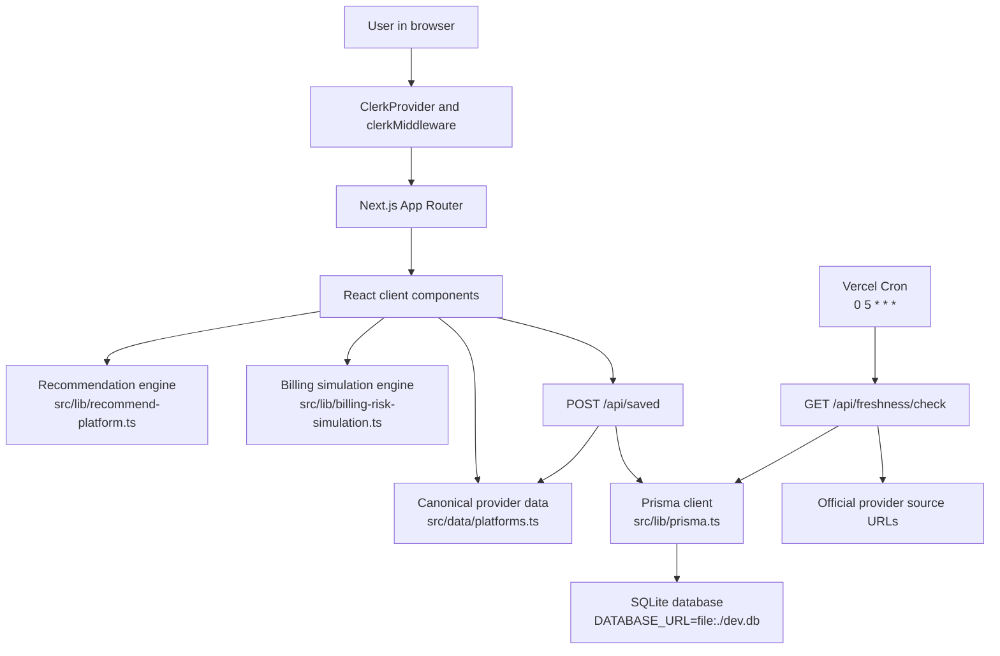
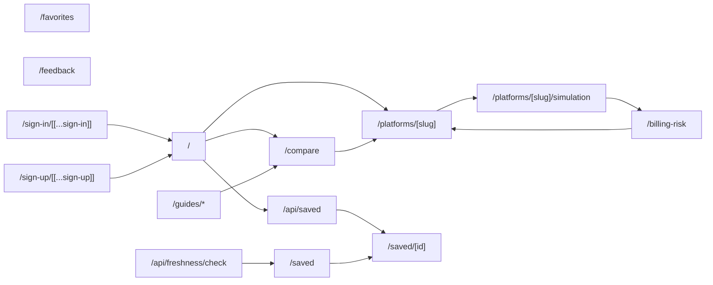
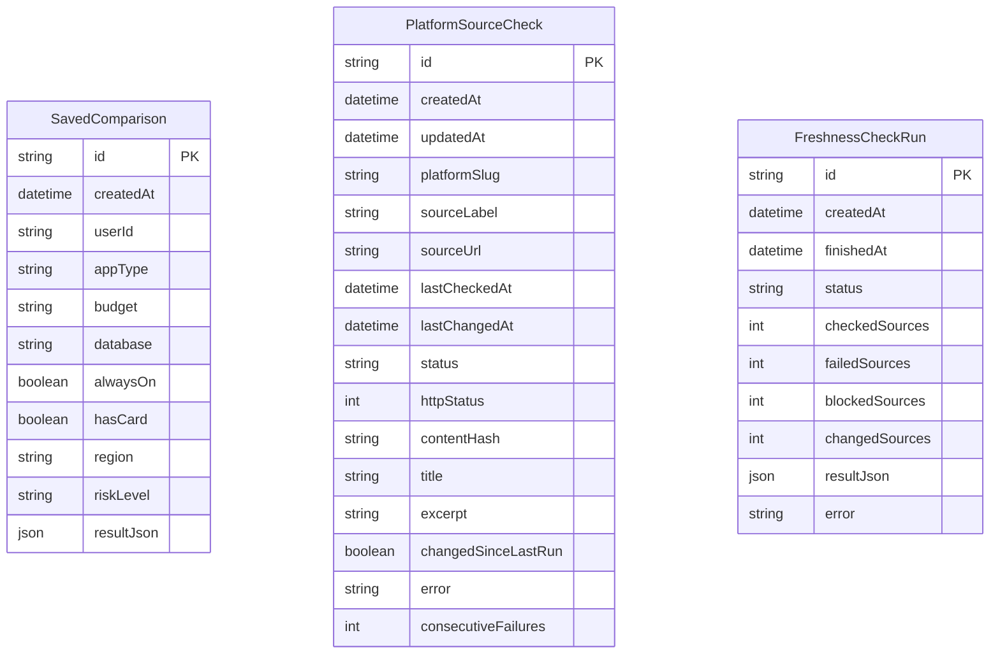
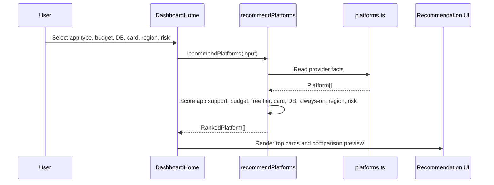
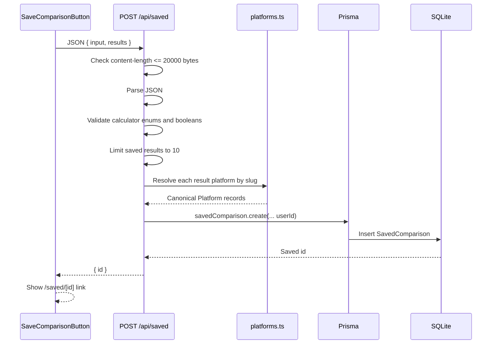
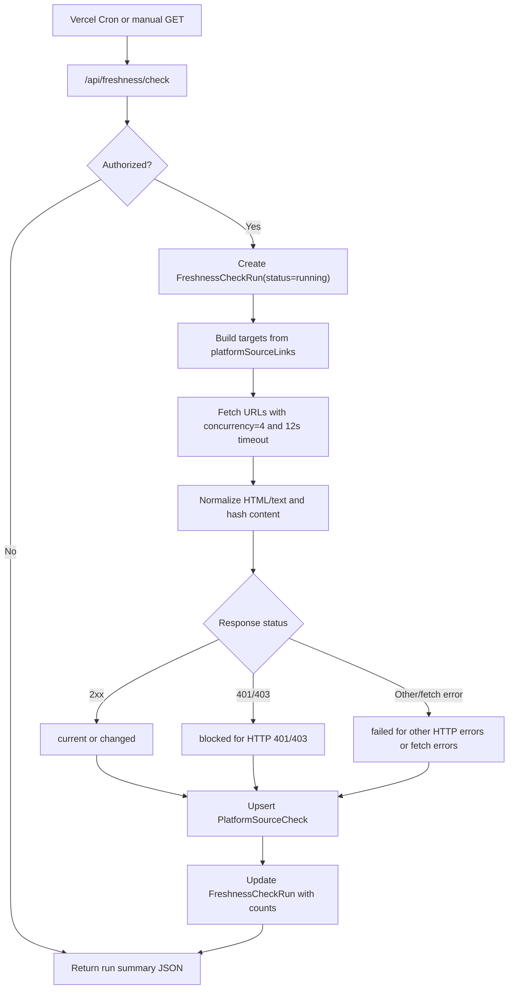
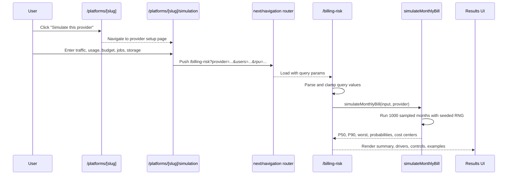
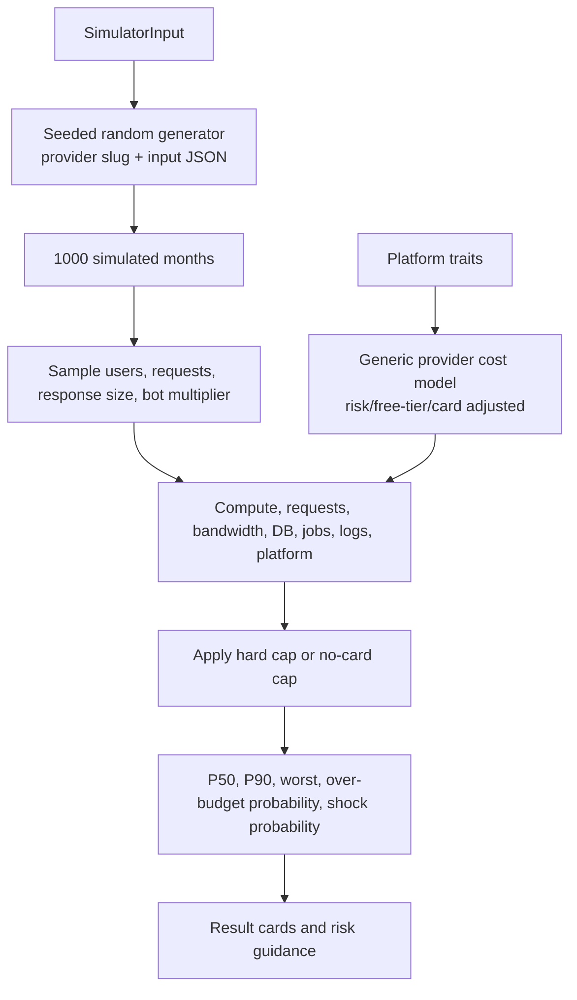
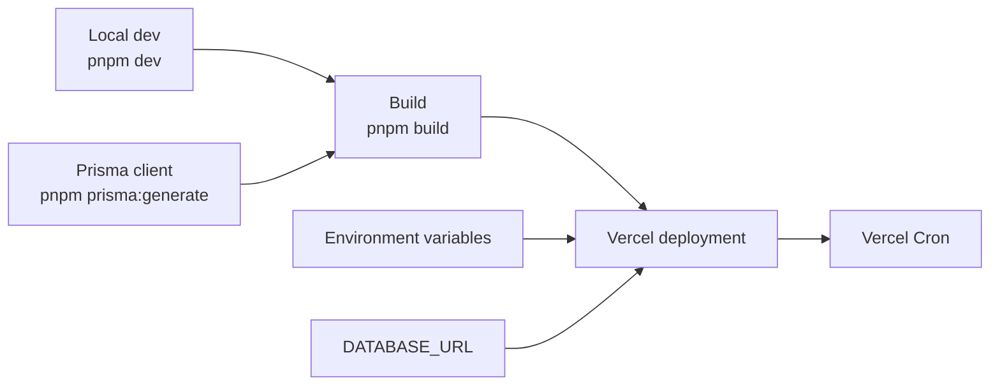
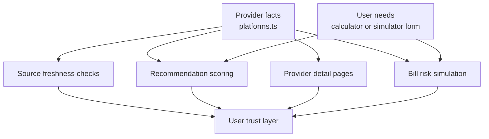

# ShipCheap Codebase And Pipeline Report

Generated: 2026-06-08

Branch inspected: `codex/billing-risk-simulator`

Workspace: `/Users/prasiddhnaik/Documents/shipcheap`

## 1. Executive Summary

ShipCheap is a Next.js App Router application for comparing beginner-friendly hosting platforms by cost, runtime fit, database fit, credit-card requirements, and billing risk.

The codebase currently has four major product flows:

1. Recommendation flow: user inputs hosting needs, ShipCheap scores providers from canonical local data, and shows ranked results.
2. Provider comparison and detail flow: provider data powers comparison tables, provider pages, official source links, community notes, and provider-specific simulation entry points.
3. Saved comparison flow: client sends a recommendation snapshot to `/api/saved`; the server validates inputs and reconstructs saved platform data from canonical provider records before persisting to Prisma.
4. Freshness automation flow: Vercel Cron calls `/api/freshness/check`; the server checks official source URLs, hashes normalized content, persists status, and separates blocked provider pages from real failures.

The current branch also adds a billing-risk simulator:

- `/billing-risk`
- `/platforms/[slug]/simulation`
- `src/lib/billing-risk-simulation.ts`
- `src/components/BillingRiskSimulator.tsx`
- `src/components/ProviderSimulationForm.tsx`

The simulator is deterministic for the same provider and input. It runs 1,000 sampled months using ShipCheap provider traits plus generic usage assumptions. It is useful for showing risk shape, but it is not yet an official provider-pricing calculator.

## 2. Technology Stack

| Area | Current implementation |
| --- | --- |
| Framework | Next.js `16.2.6` with App Router |
| React | React `19.2.4` |
| Language | TypeScript |
| Styling | Tailwind CSS 4 via global CSS and utility classes |
| Auth shell | Clerk via `@clerk/nextjs` |
| Database | Prisma `6.19.3` with SQLite in local development |
| Icons | `lucide-react`, `simple-icons` |
| Package manager | `pnpm` |
| Deployment automation | Vercel Cron configured in `vercel.json` |
| Security override | `pnpm.overrides.postcss = 8.5.15` |

Relevant files:

- `package.json`
- `src/app/layout.tsx`
- `src/proxy.ts`
- `prisma/schema.prisma`
- `vercel.json`
- `.env.example`

## 3. High-Level Architecture



## 4. Route Map



Route files:

| Route | File | Purpose |
| --- | --- | --- |
| `/` | `src/app/page.tsx` | Renders `DashboardHome` |
| `/compare` | `src/app/compare/page.tsx` | Full provider comparison table |
| `/platforms/[slug]` | `src/app/platforms/[slug]/page.tsx` | Provider detail page |
| `/platforms/[slug]/simulation` | `src/app/platforms/[slug]/simulation/page.tsx` | Provider-specific simulator setup form |
| `/billing-risk` | `src/app/billing-risk/page.tsx` | Full billing risk simulator |
| `/saved` | `src/app/saved/page.tsx` | Lists recent saved comparisons |
| `/saved/[id]` | `src/app/saved/[id]/page.tsx` | Opens a saved comparison snapshot |
| `/favorites` | `src/app/favorites/page.tsx` | Shows lower-friction providers |
| `/feedback` | `src/app/feedback/page.tsx` | Session-only feedback form |
| `/guides/no-card-hosting` | `src/app/guides/no-card-hosting/page.tsx` | No-card hosting guide |
| `/sign-in` | `src/app/sign-in/[[...sign-in]]/page.tsx` | Clerk sign-in |
| `/sign-up` | `src/app/sign-up/[[...sign-up]]/page.tsx` | Clerk sign-up |
| `/api/saved` | `src/app/api/saved/route.ts` | Save comparison endpoint |
| `/api/freshness/check` | `src/app/api/freshness/check/route.ts` | Scheduled source checker endpoint |

## 5. Data Ownership

The canonical provider registry lives in `src/data/platforms.ts`.

It owns:

- `platforms`: core provider facts used by ranking, comparison, detail pages, favorites, and simulator provider selection.
- `platformCategories`: provider category mapping.
- `platformSourceLinks`: official pricing/docs/source URLs used by detail pages and freshness checks.
- `platformCommunityInfo`: community links and adoption notes.
- Lookup helpers:
  - `getPlatformBySlug`
  - `getPlatformCategory`
  - `getPlatformSourceLinks`
  - `getPlatformCommunityInfo`

Important rule: provider slugs are the trust anchor. User-supplied platform data should not be trusted when saving or restoring comparisons.

## 6. Prisma Data Model



Tables:

| Model | Purpose |
| --- | --- |
| `SavedComparison` | Stores shareable comparison snapshots |
| `PlatformSourceCheck` | Stores latest source-check state per provider/source URL |
| `FreshnessCheckRun` | Stores each scheduled/manual freshness run summary |

Notes:

- Local development uses SQLite via `DATABASE_URL="file:./dev.db"`.
- `SavedComparison` is scoped by Clerk `userId`; legacy local rows created before this change use a sentinel owner and are hidden from real users.
- `PlatformSourceCheck` has a unique compound key on `platformSlug + sourceUrl`.
- Freshness status distinguishes `blocked` from `failed`.

## 7. Recommendation Pipeline

Main files:

- `src/components/DashboardHome.tsx`
- `src/components/CalculatorForm.tsx`
- `src/lib/recommend-platform.ts`
- `src/lib/types.ts`
- `src/lib/utils.ts`
- `src/data/platforms.ts`



Scoring logic:

| Factor | Effect |
| --- | --- |
| App type support | Major positive if supported, major penalty if not |
| Budget fit | Positive when provider budget range matches |
| Free tier | Extra positive for free-budget users |
| Credit card | Major penalty if user has no card and provider requires one |
| Database | Positive when selected database is supported |
| Always-on | Positive when always-on is supported or not required |
| Region | Positive when provider covers selected region |
| Billing risk | Positive when provider risk is inside user tolerance |

The dashboard also applies extra client-side preference adjustments for Docker, serverless, custom domains, and daily backups.

## 8. Saved Comparison Pipeline

Main files:

- `src/components/SaveComparisonButton.tsx`
- `src/app/api/saved/route.ts`
- `src/app/saved/page.tsx`
- `src/app/saved/[id]/page.tsx`
- `src/lib/prisma.ts`
- `prisma/schema.prisma`



Security behavior:

- Rejects oversized request bodies with `413`.
- Rejects invalid JSON with `400`.
- Rejects malformed calculator input with `400`.
- Rebuilds saved result platform objects from server-owned `src/data/platforms.ts`.
- Caps stored result count at 10.
- Truncates saved reason/warning strings.
- Requires a signed-in Clerk user and stores the Clerk `userId`.

Current limitation:

- Saved comparison links are private to the owning Clerk user. A future sharing feature would need a separate explicit public-share token instead of reusing the private saved ID.

## 9. Freshness Automation Pipeline

Main files:

- `vercel.json`
- `src/app/api/freshness/check/route.ts`
- `src/lib/platform-source-checker.ts`
- `src/data/platforms.ts`
- `prisma/schema.prisma`

Vercel Cron:

```json
{
  "path": "/api/freshness/check",
  "schedule": "0 5 * * *"
}
```



Authorization:

- If `CRON_SECRET` is set, the route expects `Authorization: Bearer <CRON_SECRET>`.
- If `CRON_SECRET` is not set, the route is allowed only outside production.

Freshness status semantics:

| Status | Meaning |
| --- | --- |
| `current` | Source fetched and content hash matches last known hash |
| `changed` | Source fetched and content hash changed since last run |
| `blocked` | Provider returned HTTP `401` or `403` to automation |
| `failed` | Fetch failed or provider returned another non-OK status |

Why `blocked` matters:

Some provider-owned pricing pages block server-side automation. Treating those as separate from internal failures prevents false alarms and points the app toward official API/docs fallbacks.

## 10. Billing-Risk Simulator Pipeline

Main files:

- `src/app/platforms/[slug]/page.tsx`
- `src/app/platforms/[slug]/simulation/page.tsx`
- `src/components/ProviderSimulationForm.tsx`
- `src/app/billing-risk/page.tsx`
- `src/components/BillingRiskSimulator.tsx`
- `src/lib/billing-risk-simulation.ts`



Query parameters:

| Param | Meaning | Clamp in `/billing-risk` |
| --- | --- | --- |
| `provider` | Provider slug | Must exist in `platforms` |
| `hasCard` | Whether a payment card is attached | `true` or `false` |
| `traffic` | Traffic profile | `small`, `steady`, `spike` |
| `spend` | Spend control | `none`, `alerts`, `hard-cap` |
| `data` | Data/storage load | `none`, `small`, `growing`, `heavy` |
| `bandwidth` | Bandwidth-heavy app | `true` or `false` |
| `logs` | Retain logs/metrics | `true` or `false` |
| `jobs` | Job load | `none`, `scheduled`, `always-on` |
| `users` | Monthly users | `0` to `10,000,000` |
| `rpu` | Requests per user | `1` to `10,000` |
| `responseKb` | Average response size | `1` to `100,000` |
| `storageGb` | Storage size | `0` to `1,000,000` |
| `jobHours` | Job/worker hours | `0` to `100,000` |
| `budget` | Budget limit | `1` to `1,000,000` |

Simulation model:



Important caveat:

The model is currently generic. It estimates risk shape from provider traits, not exact official pricing. To make it pricing-grade, the next step is a source-backed provider pricing layer with explicit assumptions per provider.

## 11. Auth And Session Boundary

Auth-related files:

- `src/app/layout.tsx`
- `src/proxy.ts`
- `src/app/sign-in/[[...sign-in]]/page.tsx`
- `src/app/sign-up/[[...sign-up]]/page.tsx`
- `src/components/AuthControls.tsx`

Current behavior:

- The app is wrapped in `ClerkProvider`.
- `src/proxy.ts` installs `clerkMiddleware()` across app and API route matchers.
- Sign-in and sign-up pages use Clerk's hosted UI components.
- The saved-comparison API enforces user ownership with Clerk `userId`.

Interpretation:

Clerk is integrated at the shell/routing layer, and saved filters now use server-side `userId` ownership. Any future user-owned data should follow the same pattern: authenticate on the server, persist `userId`, and include `userId` in all Prisma reads and writes.

## 12. Deployment And Operations



Required environment variables:

| Variable | Purpose |
| --- | --- |
| `DATABASE_URL` | Prisma database connection; local example is SQLite |
| `NEXT_PUBLIC_CLERK_PUBLISHABLE_KEY` | Clerk browser key |
| `CLERK_SECRET_KEY` | Clerk server key |
| `NEXT_PUBLIC_CLERK_SIGN_IN_URL` | Clerk sign-in route |
| `NEXT_PUBLIC_CLERK_SIGN_UP_URL` | Clerk sign-up route |
| `CRON_SECRET` | Optional production secret for freshness route |

Useful commands:

```sh
pnpm install
pnpm dev
pnpm lint
pnpm build
pnpm exec tsc --noEmit
pnpm prisma:generate
pnpm prisma:migrate
pnpm audit --audit-level moderate
```

## 13. Validation Gates

Use the narrowest check that matches the change.

| Change type | Recommended validation |
| --- | --- |
| General code changes | `pnpm lint`, `pnpm build` |
| Next.js route or type uncertainty | `pnpm exec tsc --noEmit`, plus relevant local Next docs |
| Prisma schema/model changes | `pnpm prisma:generate`, then `pnpm build` |
| Prisma migration changes | `pnpm prisma:migrate` when applying a local dev migration is intended |
| Security or dependency changes | `pnpm audit --audit-level moderate` |
| Frontend UI changes | `pnpm dev`, browser inspection on desktop and mobile widths |
| Freshness automation changes | Local GET `/api/freshness/check` with safe env and review persisted rows |
| Billing simulator changes | Browser test provider page -> simulation form -> `/billing-risk` query result |

## 14. Current Worktree Note

At report generation time, these simulator-related files were locally modified or untracked:

```text
 M src/app/billing-risk/page.tsx
 M src/app/platforms/[slug]/page.tsx
 M src/components/BillingRiskSimulator.tsx
?? src/app/platforms/[slug]/simulation/
?? src/components/ProviderSimulationForm.tsx
?? src/lib/billing-risk-simulation.ts
```

This report was added separately under `docs/` and should not require changing the simulator implementation.

## 15. Main Engineering Risks

1. Explicit sharing

   Saved comparisons are now private to the owning Clerk user. If the product needs public sharing later, add a separate explicit share token so private saved IDs do not become public access keys.

2. Pricing accuracy

   The provider registry and simulator are useful for product discovery, but pricing data changes often. Source freshness helps detect upstream changes, but exact pricing-grade simulation requires provider-specific pricing assumptions.

3. Freshness fetch reliability

   Some providers block automated fetches. The current system correctly models `blocked`, but the product should surface that state clearly instead of implying the data is always verified live.

4. Prisma migration consistency

   Prisma schema changes should be followed by `pnpm prisma:generate`. Build/type failures after schema edits are often caused by a stale generated client.

5. Client-side scoring transparency

   Recommendation scoring is deterministic and local, but users may not understand how each score was reached unless the UI continues exposing matched reasons and warnings.

## 16. Good Next Additions

1. Add an assumptions panel to the billing simulator showing the exact generic cost rates and free allowances used.
2. Replace generic simulator cost rates with source-backed provider-specific pricing records.
3. Add an explicit public-share token flow for saved comparisons if users should share private results with others.
4. Add a freshness status dashboard or admin page using `PlatformSourceCheck` and `FreshnessCheckRun`.
5. Add automated tests for:
   - recommendation scoring
   - `/api/saved` validation
   - simulator query parsing and clamping
   - freshness result classification
6. Add a public "last verified" timestamp on provider pages using persisted freshness results.

## 17. Mental Model

ShipCheap is best understood as a provider-risk decision engine:



The strongest product direction is not just "compare cheap hosts." It is "show the cheapest safe path, explain where the billing traps are, and keep the underlying claims fresh enough to trust."
